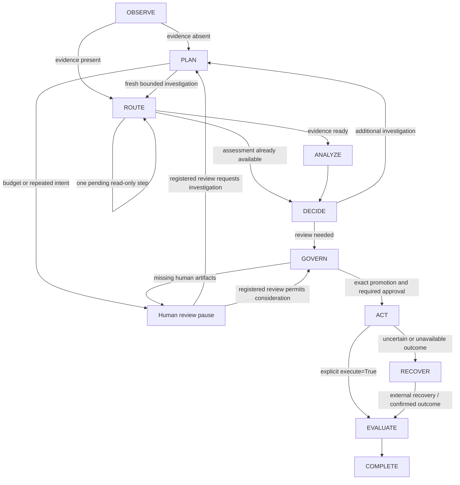

# Phase 5-1: stateful investigation runtime

`SOCRuntime` in `src/soc_agent/investigation/runtime/` coordinates existing contracts.
**The Orchestrator coordinates authority; it does not own authority.**

It extends investigation orchestration by composition, reusing the existing
InvestigationOrchestrator for every investigation step. It is not an authorization service. `start(incident_id)` attaches to a registered
incident; each explicit `await advance(incident_id, ...)` performs one bounded step.
There is no background runner, automatic execution loop, or automatic retry.

## Routing and results

The diagram condenses pauses: the cursor remains at PLAN, GOVERN, ACT or RECOVER;
PAUSE is not an IncidentState status or a separate runtime enum. COMPLETE means
workflow termination, not successful remediation. Inspect `failure`.

Every `WorkflowResult` contains `incident_id`, `current_step`, `next_step`, `reason`,
`references` (typed artifact kind/identity pairs), `waiting_for_human`, `terminal`,
and an optional structured `failure`. `artifacts(incident_id)` exposes the anchored
investigation, assessment (including fusion lineage), decision, response plan and
execution identity. Snapshot revisions advance only after successful publication.

| Step | Work performed in one call |
| --- | --- |
| OBSERVE | Route present evidence or select investigation. Closed incidents terminate. |
| PLAN | Request one plan from the existing InvestigationPlanner; validate fresh pending steps and finite budget. |
| ROUTE | Execute at most one pending step through InvestigationOrchestrator with `require_read_only=True`, or route analysis. |
| ANALYZE | Optional injected model/fusion adapter, existing ThreatAssessor, then restricted analysis CAS. |
| DECIDE | Existing IncidentDecisionEngine; insufficient analytical basis returns to investigation. |
| GOVERN | Validate externally issued human artifacts and form an advisory ResponsePlan; pause for review, promotion and approval. |
| ACT | Pause unless this call explicitly supplies `execute=True`; dispatch only through existing DurableExecutor. |
| EVALUATE | Read authoritative durable outcome and terminate with explicit success/failure. |
| RECOVER | Read existing durable record only. Never create another intent, claim, execute, or retry. |
| COMPLETE | Return terminal result idempotently, retaining failure and artifacts. |

## Human review, pause and resume

The runtime does **not** create HumanReviewRequest, HumanReviewRecord, confirmation,
response review, promotion or Tool Approval. A waiting result is a request to the
caller to use the existing independently authenticated human governance workflow.

1. Obtain the current decision and authoritative incident snapshot.
2. Through `PersistentHumanReviewService`, externally request and record a review
   with a real, purpose-bound human confirmation. Supply that record to `advance`.
3. The runtime validates exact stored provenance, snapshot, decision identity and
   digest. Forged, stale, cross-decision, or replaced reviews fail closed.
4. Accepting a new review consumes this call's step. It never dispatches a tool.
   INVESTIGATE routes to PLAN without resetting the budget. Other valid outcomes
   route to GOVERN; REJECTED then terminates without response consideration.
5. Supply explicit CandidateIntent values at GOVERN. An empty candidate set pauses
   without permanently caching an empty response plan.
6. Use existing response review and PromotionService externally. Supply the exact
   promotion originating from this runtime's response plan. WRITE still requires
   the independently confirmed, precisely bound Tool Approval.
7. A validated promotion/approval moves GOVERN to ACT. A **subsequent** explicit
   `advance(..., execute=True)` dispatches. Passing execute at GOVERN is not enough.

Human review after a loop guard permits governed consideration, not automatic
progress or authorization. All existing advisory blockers, promotion policy and
approval requirements still apply. Repeating calls without a valid review does
nothing. Human INVESTIGATE cannot reset the guard. Default budget: two plans per
workflow; previously attempted `(tool_name, canonical_input)` is also blocked even
if a planner supplies a new step ID. New evidence invalidates prior assessment,
decision, review and response plan; published analysis history remains in state.

Pause retains existing analytical artifacts and does not re-run the LLM. Input
bundles are validated before assigning review/promotion/approval, so an invalid
approval cannot partially accept a supplied review. Per-incident asyncio locks
serialize calls in one runtime. CAS and durable claims remain the cross-runtime
concurrency boundaries.

## State mutation boundary

`SQLiteGovernanceStore.append_assessment(expected_anchor, result)` is the only new
publication capability. It revalidates exact AssessmentResult/FusionAssessmentResult
contracts and nested links, checks the full current StateAnchor in a transaction,
and permits only append-only validated Observation/Hypothesis records plus their
nondecreasing update timestamp. It preserves existing entries and ordering.

Status, severity, confidence, incident identity, Evidence, creation time and every
other protected field must remain exactly unchanged. Evidence insertion, deletion
or edits through this path fail closed. Timestamp-only updates are rejected.
Fusion-aware analysis must leave the entire incident state unchanged: model context
cannot be converted into new facts. An unchanged result is a no-op, not a revision.
Successful additions create one new snapshot and `assessment_appended` audit event
atomically; stale anchors or validation failures publish nothing. Advisory severity
never becomes authoritative incident severity through this API.

Investigation Evidence is produced by the **existing** governed
InvestigationOrchestrator's ToolResult conversion and published through the existing
`append_evidence` boundary. The runtime neither invents Evidence nor calls Tools
directly. State transitions still require existing human-authorized state services.

## Durable execution and recovery

Policy is checked by existing bridge/promotion/execution services, including at
actual dispatch. DENY is never overridden. A missing WRITE approval pauses.
FAILED is an explicit `execution_failed` result, preserved through COMPLETE.

Before intent creation, the runtime retains the existing ExecutionBinding content
identity. If intent creation commits but its reply is lost, subsequent calls can
query that identity and remain in RECOVER without dispatching. Existing non-pending
records are inspected instead of executed. The durable store enforces claim/replay
constraints for competing callers. UNCERTAIN, unavailable records, and unresolved
pre-invocation lifecycles select RECOVER; `execute=True` cannot retry them.
Cancellation propagates while retaining the recovery cursor once dispatch begins.

Recovery and reconciliation occur **outside** this coordinator using existing
ExecutionStore recovery and human-confirmed reconciliation contracts. Once those
contracts establish SUCCEEDED or FAILED, advance reads the outcome, routes through
EVALUATE and terminates. Incident snapshot changes cannot prevent querying an
already-created execution identity.

## Scope and limitations

- Without the optional Phase 5-3 CheckpointStore, runtime cursors and analysis
  result objects are process-local. SQLite incident snapshots and execution records
  are durable. The opt-in restart contract is described below.
- There is no automatic startup runner. With CheckpointStore, explicitly call
  restore; without it, inspect durable execution records using existing recovery.
- External incident mutation before dispatch pauses with a snapshot validation
  failure; this runtime never silently rebinds reviews or approvals. Start a new
  explicitly configured runtime only after operator review of outstanding work.
- A response plan contains alternatives. This runtime tracks one explicit promoted
  action, not an automatically executed multi-action response sequence.
- Read-only investigation uses the existing non-durable orchestrator. It has a
  deterministic no-repeat guard, not crash-resumable investigation execution.
- An injected model-analysis adapter composes existing Security AI / Fusion; no new
  model training, saved-model E2E, authentication backend or authority is added.
- Frozen contracts and reference validation enforce structural provenance, not
  the semantic truth of LLM statements. Existing assessment limitations remain.

## Verification

New isolated tests live in `tests/unit/investigation_runtime/`. They use real
planning/assessment/governance/promotion/durable services with deterministic LLM
and Tool adapters and explicit test-only human confirmations. They cover routing,
investigation, pause/resume, WRITE approval, DENY, FAILED, UNCERTAIN/reconciliation,
loop guards, stale/forged inputs, ambiguous commits, cancellation, and restricted
analysis publication. No saved-model E2E is added. Existing `tests/fusion_support.py`
is left unchanged.

## Phase 5-2: composed incident lifecycle and trace

The existing runtime is the only coordinator. The E2E composition is exercised in
`tests/integration/orchestration/`; no second orchestrator or execution worker is
introduced. A caller registers an IncidentState and any normalized input Evidence
using existing ingestion contracts, then calls `start` and explicitly advances it.

- The READ_ONLY scenario begins without investigation Evidence, takes PLAN/ROUTE,
  collects a real mock ToolResult through InvestigationOrchestrator, assesses and
  decides, waits for externally recorded reviews/promotion, then explicitly
  dispatches a read-only candidate through DurableExecutor and evaluates its result.
- The AI/WRITE scenario begins with synthetic network-event Evidence. The existing
  NetworkFeatureExtractor, SecurityAISelector, SecurityAI wrapper/investigator and
  FusionEngine feed ThreatAssessor. A test model supplies contract-valid synthetic
  predictions; no saved package is loaded and no model is trained. The actual
  selector, signal, feature/provenance and fusion validators run. Analysis LLM and
  selection LLM outputs are mocks, not independent security findings.
- The resulting advisory concern loops back into investigation and is reassessed
  only after new Evidence. Model context remains separate from Evidence and does
  not create observations or confirmed compromise. Human review can subsequently
  request governed response consideration; it cannot approve the Tool.
- The WRITE workflow waits for explicit response review/promotion and then for an
  independently confirmed exact Tool Approval. Repeated waiting calls retain the
  completed assessment, fusion and decision. ACT still requires a separate explicit
  dispatch call. The tests use existing test-only human confirmation adapters and
  mock Tools; they do not establish production authentication or response efficacy.

### Immutable orchestration trace

`runtime.trace(incident_id)` returns an immutable `OrchestrationTrace`. Each entry
has `entry_id` and `content`, containing:

- `sequence`: contiguous, starting at one;
- `snapshot`: authoritative store identity, incident, revision and fingerprint;
- `result`: the exact returned WorkflowResult, including incident, current/next step,
  reason, artifact references, waiting/terminal flags and failure category;
- `previous_entry_id`: the preceding entry's content digest.

References include investigation, assessment, decision, incident review, response
plan, promotion, Tool Approval, durable intent and Fusion identities when present.
Existing artifact identities are recorded without converting their meaning. A trace
entry never becomes Evidence, human confirmation, Approval or execution authority.
Terminal without a failure category means the workflow ended, not necessarily that
remediation succeeded; consult the durable outcome and reason.

Entries are appended only by the runtime when returning a result. Read-only trace
access cannot append. Consecutive identical result/snapshot pairs are suppressed:
repeated human-wait polling does not create arbitrary duplicates. A genuinely new
step, changed artifact reference, snapshot or outcome is retained. Resume preserves
the existing prefix. Cancellation at dispatch records the RECOVER transition before
propagating cancellation, preserving explanatory continuity without retrying.

Sequence, incident/snapshot binding, predecessor digests, step continuity and
consecutive duplicates are validated. `validate_trace(value)` additionally compares
all exact contents with this runtime's current trace, rejecting artifact substitutions
and stale/truncated exports. Serialization round trips preserve entry identities.
There is no new wall-clock timestamp in the trace identity; existing snapshot and
artifact identities remain part of its input. Ordering is deterministic for a given
serialized sequence of runtime results, not across newly generated random artifact
IDs or independently interleaved calls.

These are unkeyed content hashes and process-local lineage checks. An attacker who
can rewrite an exported trace can recompute hashes. This is not a signed audit log,
not tamper-proof, and not a durable trace store. Exact runtime comparison requires
the original live runtime. Trace inspection grants no authority and cannot resume
or execute anything by itself.

### Recovery and E2E safety

SUCCEEDED routes through EVALUATE to COMPLETE. FAILED remains an explicit failure.
UNCERTAIN stays in RECOVER, even when the caller repeatedly asks to execute. The
runtime queries the existing durable record and never assumes missing success means
failure. An untrusted reconciliation request is rejected by the existing authority;
only externally confirmed reconciliation changes the durable outcome. The next
advance observes that outcome and completes without another Tool invocation.

E2E tests also cover current Policy DENY after human approval, stale state after
approval, altered promoted input, State Change Authorization used as Tool Approval,
cross-incident review substitution, and protected-field changes from an analysis
adapter. These fail closed. The existing governance services and restricted analysis
CAS enforce the boundaries; the trace records the resulting explanation.

Phase 5-2 kept the Phase 5-1 process-local cursor limitation. Phase 5-3 adds an
explicit optional checkpoint store below. There is no distributed orchestrator,
automatic approval, automatic uncertain retry or exactly-once external side-effect
guarantee.

Phase 5-2 verification results: 22 new E2E/trace tests passed; 431 Phase 5-1,
governance and durable regression tests passed. The single full pytest run completed
with **1,859 passed, exit 0** (401.93 seconds), against the 1,837-test baseline.

## Phase 5-3: durable checkpoints and explicit restart

**Checkpoint records progress. Checkpoint does not grant authority.**

Pass `checkpoints=CheckpointStore(governance_store)` to the existing SOCRuntime to
opt in. The memory-only construction remains available and compatible. Use the
same explicitly configured private SQLite file as IncidentState and durable
execution. No global database path or replacement persistence framework is added.

### Schema and data

The existing chain is governance v1, durable execution v2, confirmations v3.
`migrate_checkpoints(database)` explicitly upgrades **v3 to v4** with two additive
tables: `workflow_checkpoints` and `workflow_trace`. Earlier migrations must be
called explicitly first. Existing incident snapshots, human governance artifacts,
execution records/events and confirmation consumption records are preserved.
Migration DDL and version update share the existing transaction. A failure rolls
back partial DDL; unsupported future versions fail without reset. Earlier consumers
recognize v4 while retaining their unchanged domain and table contracts.

There is one workflow run per registered incident in this initial implementation.
The checkpoint has a run UUID, incident, checkpoint revision, snapshot anchor,
last exact WorkflowResult (current/next step, wait/terminal/failure and references),
round limit/count, canonical attempted investigation inputs, and creation/update
metadata. Validated analysis, investigation and advisory artifacts are cached for
resume. A cached ResponsePlan includes its original human-review citation, but
that citation is revalidated against the existing authoritative review ledger.
No Tool Approval object, human confirmation, credential or token is copied into
checkpoint storage. Review, promotion and approval identities remain references.

Trace entries are stored once under `(run_id, sequence)` with their existing
content identities. The trace prefix is immutable in publication; checkpoint/head,
incident, run, sequence and artifact references are validated on reads. Checkpoint
publication, new trace entries and claim release commit atomically. Polling a
stable human wait may advance checkpoint revision but does not duplicate trace
entries. Restoring itself neither appends trace entries nor performs a workflow step.

### Restart lifecycle

Construct a new runtime with the same database and call `restore(incident_id)`.
Restore checks the checkpoint and complete trace, retained authoritative snapshot,
current incident anchor, analysis/decision references, persisted human review and
advisory plan. It restores the exact next step and previous artifacts without
repeating completed LLM, model/fusion or investigation work. The stored loop limit
and attempted-action guard survive even if constructor defaults later differ.
Stale active snapshots or stale/invalid artifacts fail closed, rather than silently
replanning or reauthorizing. Terminal/outcome-only checkpoints may inspect their
validated historical snapshot even if the incident subsequently changed.

At GOVERN after a restart, an Incident Review is fetched and revalidated from its
existing authoritative store. An unapproved WRITE candidate remains waiting.
The current PromotionService/ExecutionBridge issuance graphs are still memory
based: a pre-intent promotion reference in a checkpoint is not imported as a trusted
promotion. Supply a separately reviewed, currently valid promotion through the
existing live service and, when required, a separate exact Tool Approval. The
stored response plan and analysis are retained; these human operations are external
to the orchestrator and never automatically generated.

In durable mode, GOVERN persists a verified **ExecutionIntent in the existing
ExecutionStore** before returning ACT. This does not claim or invoke the Tool.
The intent's existing execution-side approval snapshot is the authoritative source
for restart, not the checkpoint. ACT requires a subsequent explicit execute call.
A restored ACT uses that exact ledger intent and the existing DurableExecutor's
state/tool/schema/input/policy/approval and replay checks. A checkpoint with an ACT
reference but no recoverable authority cannot authorize execution by itself.

### CAS and interruptions

Before advancing, the runtime atomically claims its expected checkpoint revision
under `BEGIN IMMEDIATE`. Competing processes either see the active claim or lose
revision CAS. Only the claimant can publish a successor with the next revision and
unchanged trace prefix. No SQLite transaction is held across LLM, model or Tool work.
Independent spawned Python interpreters test both initial observation and resume
from an already completed assessment: one advances, the other reports conflict.

A process crash or publication failure **during** a claimed step is different from
a clean checkpoint boundary. The claim is not stolen or expired automatically.
Restore raises `WorkflowInFlight`; operator investigation of authoritative incident
and execution records is required. There is deliberately no automatic claim release
or interrupted-investigation retry API in this phase. This sacrifices availability
rather than risking repeating work or an external side effect. A caller receiving
an uncertain commit must stop using that runtime. A fresh read may confirm a
successfully published successor; an unresolved active claim remains blocked.

`StaleCheckpoint` distinguishes revision conflicts; `WorkflowInFlight` distinguishes
active/interrupted work. Existing StorageError and CommitOutcomeUnknown propagate
for persistence problems. They are not converted into permission or normal success.
Domain validation, governance blocks, execution FAILED and execution UNCERTAIN
retain their existing meanings.

### Recovery and limitations

A successfully published RECOVER checkpoint restores as RECOVER and queries its
exact durable execution record. Repeated execute requests cannot retry it. Trusted
reconciliation is performed externally through the existing authority contract;
only its recorded outcome lets the resumed workflow evaluate and complete.
Completed workflows and successful execution records never redispatch on restore.

SQLite transaction and external Tool side effects are **not atomic**. Exactly-once
external execution is not guaranteed. Incident/analysis publication and checkpoint
publication are also separate transactions; an interrupted step may therefore need
operator investigation even if its incident or execution record already committed.
Claims intentionally block that ambiguous work from being repeated automatically.

The supported concurrency scope is cooperating processes on a same-host local
SQLite filesystem. There is no distributed orchestration, multi-host coordination,
background resume worker, signed audit log or protection from a database administrator
rewriting all records and hashes. No automatic new run replaces an existing run.
