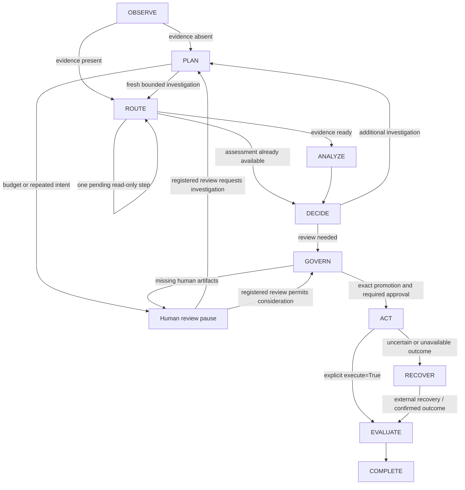

# Phase 5-1: stateful investigation runtime

`SOCRuntime` in `src/soc_agent/investigation/runtime/` coordinates existing contracts.
**The Orchestrator coordinates authority; it does not own authority.**

It extends investigation orchestration by composition, reusing the existing
InvestigationOrchestrator for every investigation step. It is not an authorization service. `start(incident_id)` attaches to a registered
incident; each explicit `await advance(incident_id, ...)` performs one bounded step.
There is no background runner, automatic execution loop, or automatic retry.

## Routing and results

The diagram condenses pauses: the cursor remains at PLAN, GOVERN, ACT or RECOVER;
PAUSE is not an IncidentState status or a separate runtime enum. COMPLETE means
workflow termination, not successful remediation. Inspect `failure`.

Every `WorkflowResult` contains `incident_id`, `current_step`, `next_step`, `reason`,
`references` (typed artifact kind/identity pairs), `waiting_for_human`, `terminal`,
and an optional structured `failure`. `artifacts(incident_id)` exposes the anchored
investigation, assessment (including fusion lineage), decision, response plan and
execution identity. Snapshot revisions advance only after successful publication.

| Step | Work performed in one call |
| --- | --- |
| OBSERVE | Route present evidence or select investigation. Closed incidents terminate. |
| PLAN | Request one plan from the existing InvestigationPlanner; validate fresh pending steps and finite budget. |
| ROUTE | Execute at most one pending step through InvestigationOrchestrator with `require_read_only=True`, or route analysis. |
| ANALYZE | Optional injected model/fusion adapter, existing ThreatAssessor, then restricted analysis CAS. |
| DECIDE | Existing IncidentDecisionEngine; insufficient analytical basis returns to investigation. |
| GOVERN | Validate externally issued human artifacts and form an advisory ResponsePlan; pause for review, promotion and approval. |
| ACT | Pause unless this call explicitly supplies `execute=True`; dispatch only through existing DurableExecutor. |
| EVALUATE | Read authoritative durable outcome and terminate with explicit success/failure. |
| RECOVER | Read existing durable record only. Never create another intent, claim, execute, or retry. |
| COMPLETE | Return terminal result idempotently, retaining failure and artifacts. |

## Human review, pause and resume

The runtime does **not** create HumanReviewRequest, HumanReviewRecord, confirmation,
response review, promotion or Tool Approval. A waiting result is a request to the
caller to use the existing independently authenticated human governance workflow.

1. Obtain the current decision and authoritative incident snapshot.
2. Through `PersistentHumanReviewService`, externally request and record a review
   with a real, purpose-bound human confirmation. Supply that record to `advance`.
3. The runtime validates exact stored provenance, snapshot, decision identity and
   digest. Forged, stale, cross-decision, or replaced reviews fail closed.
4. Accepting a new review consumes this call's step. It never dispatches a tool.
   INVESTIGATE routes to PLAN without resetting the budget. Other valid outcomes
   route to GOVERN; REJECTED then terminates without response consideration.
5. Supply explicit CandidateIntent values at GOVERN. An empty candidate set pauses
   without permanently caching an empty response plan.
6. Use existing response review and PromotionService externally. Supply the exact
   promotion originating from this runtime's response plan. WRITE still requires
   the independently confirmed, precisely bound Tool Approval.
7. A validated promotion/approval moves GOVERN to ACT. A **subsequent** explicit
   `advance(..., execute=True)` dispatches. Passing execute at GOVERN is not enough.

Human review after a loop guard permits governed consideration, not automatic
progress or authorization. All existing advisory blockers, promotion policy and
approval requirements still apply. Repeating calls without a valid review does
nothing. Human INVESTIGATE cannot reset the guard. Default budget: two plans per
workflow; previously attempted `(tool_name, canonical_input)` is also blocked even
if a planner supplies a new step ID. New evidence invalidates prior assessment,
decision, review and response plan; published analysis history remains in state.

Pause retains existing analytical artifacts and does not re-run the LLM. Input
bundles are validated before assigning review/promotion/approval, so an invalid
approval cannot partially accept a supplied review. Per-incident asyncio locks
serialize calls in one runtime. CAS and durable claims remain the cross-runtime
concurrency boundaries.

## State mutation boundary

`SQLiteGovernanceStore.append_assessment(expected_anchor, result)` is the only new
publication capability. It revalidates exact AssessmentResult/FusionAssessmentResult
contracts and nested links, checks the full current StateAnchor in a transaction,
and permits only append-only validated Observation/Hypothesis records plus their
nondecreasing update timestamp. It preserves existing entries and ordering.

Status, severity, confidence, incident identity, Evidence, creation time and every
other protected field must remain exactly unchanged. Evidence insertion, deletion
or edits through this path fail closed. Timestamp-only updates are rejected.
Fusion-aware analysis must leave the entire incident state unchanged: model context
cannot be converted into new facts. An unchanged result is a no-op, not a revision.
Successful additions create one new snapshot and `assessment_appended` audit event
atomically; stale anchors or validation failures publish nothing. Advisory severity
never becomes authoritative incident severity through this API.

Investigation Evidence is produced by the **existing** governed
InvestigationOrchestrator's ToolResult conversion and published through the existing
`append_evidence` boundary. The runtime neither invents Evidence nor calls Tools
directly. State transitions still require existing human-authorized state services.

## Durable execution and recovery

Policy is checked by existing bridge/promotion/execution services, including at
actual dispatch. DENY is never overridden. A missing WRITE approval pauses.
FAILED is an explicit `execution_failed` result, preserved through COMPLETE.

Before intent creation, the runtime retains the existing ExecutionBinding content
identity. If intent creation commits but its reply is lost, subsequent calls can
query that identity and remain in RECOVER without dispatching. Existing non-pending
records are inspected instead of executed. The durable store enforces claim/replay
constraints for competing callers. UNCERTAIN, unavailable records, and unresolved
pre-invocation lifecycles select RECOVER; `execute=True` cannot retry them.
Cancellation propagates while retaining the recovery cursor once dispatch begins.

Recovery and reconciliation occur **outside** this coordinator using existing
ExecutionStore recovery and human-confirmed reconciliation contracts. Once those
contracts establish SUCCEEDED or FAILED, advance reads the outcome, routes through
EVALUATE and terminates. Incident snapshot changes cannot prevent querying an
already-created execution identity.

## Scope and limitations

- Runtime cursors and analysis result objects are process-local, not a durable
  workflow engine. SQLite incident snapshots and execution records are durable.
- Restart does not automatically reconstruct or resume a cursor. Operators must
  inspect durable execution records and use existing recovery/reconciliation.
- External incident mutation before dispatch pauses with a snapshot validation
  failure; this runtime never silently rebinds reviews or approvals. Start a new
  explicitly configured runtime only after operator review of outstanding work.
- A response plan contains alternatives. This runtime tracks one explicit promoted
  action, not an automatically executed multi-action response sequence.
- Read-only investigation uses the existing non-durable orchestrator. It has a
  deterministic no-repeat guard, not crash-resumable investigation execution.
- An injected model-analysis adapter composes existing Security AI / Fusion; no new
  model training, saved-model E2E, authentication backend or authority is added.
- Frozen contracts and reference validation enforce structural provenance, not
  the semantic truth of LLM statements. Existing assessment limitations remain.

## Verification

New isolated tests live in `tests/unit/investigation_runtime/`. They use real
planning/assessment/governance/promotion/durable services with deterministic LLM
and Tool adapters and explicit test-only human confirmations. They cover routing,
investigation, pause/resume, WRITE approval, DENY, FAILED, UNCERTAIN/reconciliation,
loop guards, stale/forged inputs, ambiguous commits, cancellation, and restricted
analysis publication. No saved-model E2E is added. Existing `tests/fusion_support.py`
is left unchanged.
